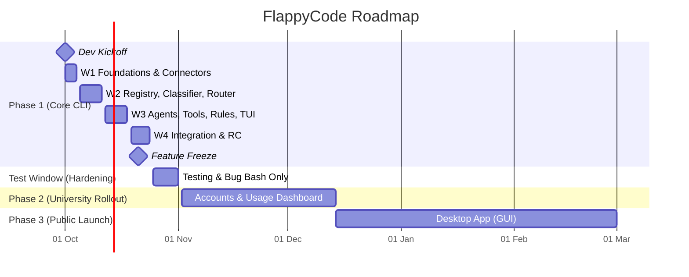

# 🐦 FlappyCode

> **Your connected providers. All the free models. One powerful coding agent.**

[](docs/TaskBreakdown.md)
[](docs/TaskBreakdown.md)
[](docs/SRS.md)
[](docs/SystemArchitecture.md)
[](docs/PRD.md)

---

> [!NOTE]  
> **Development Notice:** FlappyCode is under active Phase 1 development (Week 1: foundations & core). **It is not yet published to npm.** The package name `flappycode` will be published following Phase 1 completion.

---

```
───────────▄██████████████▄                                                                                  ▄██████████████▄───────────
───────▄████░░░░░░░░█▀────█▄                                                                                ▄█────▀█░░░░░░░░████▄───────
──────██░░░░░░░░░░░█▀──────█▄                                                                              ▄█──────▀█░░░░░░░░░░░██──────
─────██░░░░░░░░░░░█▀────────█▄                                                                            ▄█────────▀█░░░░░░░░░░░██─────
────██░░░░░░░░░░░░█──────────██                                                                          ██──────────█░░░░░░░░░░░░██────
───██░░░░░░░░░░░░░█──────██──██      █████ █      ████  ████  ████  █   █   ████  ████  ████  █████      ██──██──────█░░░░░░░░░░░░░██───
──██░░░░░░░░░░░░░░█▄─────██──██      █     █     █    █ █   █ █   █  █ █   █     █    █ █   █ █          ██──██─────▄█░░░░░░░░░░░░░░██──
─████████████░░░░░░██────────██      ████  █     ██████ ████  ████    █    █     █    █ █   █ ████       ██────────██░░░░░░████████████─
██░░░░░░░░░░░██░░░░░█████████████    █     █     █    █ █     █       █    █     █    █ █   █ █        █████████████░░░░░██░░░░░░░░░░░██
██░░░░░░░░░░░██░░░░█▓▓▓▓▓▓▓▓▓▓▓▓▓█   █     █████ █    █ █     █       █     ████  ████  ████  █████   █▓▓▓▓▓▓▓▓▓▓▓▓▓█░░░░██░░░░░░░░░░░██
██░░░░░░░░░░░██░░░█▓▓▓▓▓▓▓▓▓▓▓▓▓▓█   └────── FLAPPY (yellow) ───────┘   └───── CODE (cyan) ─────┘     █▓▓▓▓▓▓▓▓▓▓▓▓▓▓█░░░██░░░░░░░░░░░██
─▀███████████▒▒▒▒█▓▓▓███████████▀                                                                      ▀███████████▓▓▓█▒▒▒▒███████████▀─
────██▒▒▒▒▒▒▒▒▒▒▒▒█▓▓▓▓▓▓▓▓▓▓▓▓█                                                                        █▓▓▓▓▓▓▓▓▓▓▓▓█▒▒▒▒▒▒▒▒▒▒▒▒██────
─────██▒▒▒▒▒▒▒▒▒▒▒▒██▓▓▓▓▓▓▓▓▓▓█                                                                        █▓▓▓▓▓▓▓▓▓▓██▒▒▒▒▒▒▒▒▒▒▒▒██─────
──────█████▒▒▒▒▒▒▒▒▒▒██████████                                                                          ██████████▒▒▒▒▒▒▒▒▒▒█████──────
─────────▀███████████▀                                                                                            ▀███████████▀─────────

                             Multi-Provider  •  Multi-Agent  •  Free Models  •  One Assistant
                           Your connected providers. All the free models. One powerful coding agent.
```

---

## 📖 Table of Contents

- [Overview](#-overview)
- [The Problem & The FlappyCode Solution](#-the-problem--the-flappycode-solution)
- [Key Features](#-key-features)
- [Master Timeline & Milestones](#-master-timeline--milestones)
- [System Architecture](#-system-architecture)
- [CLI & Terminal Experience](#-cli--terminal-experience)
- [Planned Usage](#-planned-usage)
- [Repository Structure](#-repository-structure)
- [Documentation Index](#-documentation-index)
- [Contributing & Development Setup](#-contributing--development-setup)
- [License](#-license)

---

## 💡 Overview

**FlappyCode** is an agentic coding assistant that lives in your terminal and sits one layer above LLM providers. 

Rather than locking you into a single proprietary vendor or requiring you to burn expensive paid API credits for basic tasks, FlappyCode connects to any number of your existing provider accounts (cloud and local). It discovers their available models, filters and pools all available free and rate-limited tiers into a unified catalog, and orchestrates a collaborative graph of specialist agents governed by strict, transparent rules.

### The Core Principle
> **The more providers you connect, the larger your free model budget becomes.** FlappyCode uses that pooled capacity intelligently, safely, and transparently — **and will never charge your credit card without explicit permission.**

---

## 🎯 The Problem & The FlappyCode Solution

| Today's Options | The Pain Point | The FlappyCode Approach |
|---|---|---|
| **Single-vendor, ad-supported free tools** | Vendor-curated models, opaque session caps, user prompts mined for ads, zero control over backends. | **Vendor-neutral aggregation:** Connect your own keys/endpoints across OpenRouter, Groq, Ollama, Google AI Studio, Anthropic, OpenAI, etc. |
| **Provider-agnostic open tools** | Full user control, but assumes you are ready to pay per-token or already hold paid access. No automated inventory of free tiers. | **Unified Free Model Pool:** Automatically catalogs, classifies (`free`, `rate-limited-free`, `paid`), and routes tasks across free capacity first. |
| **Black-box AI agents** | Agents execute unreviewed code, edit files silently, or fall back to expensive paid models on rate limits. | **Strict Governance & Zero-Silent-Spend:** Mandatory plan-approval gates (`RULES.md`), diff previews, and explicit user grants before touching paid models. |

---

## ✨ Key Features

### 🌐 Multi-Provider Catalog & Auto-Discovery
- Connect unlimited providers: **OpenRouter**, **Groq**, **Google AI Studio**, **Ollama Cloud / Local**, **Kilocode**, **Together AI**, **Anthropic**, **OpenAI**, **LM Studio**, and **llama.cpp**.
- Automatic model discovery and dynamic classification into `free`, `rate-limited-free`, and `paid` tiers.
- Periodic health checks and latency monitoring.

### 🧠 Free-First Intelligent Routing (`flappyauto`)
- **Task-Aware Routing:** Selects the best-fit model from the free pool depending on task type (planning, writing code, reviewing, fast file searching).
- **Graceful Quota Degradation:** If a model hits a rate limit (HTTP 429), FlappyCode automatically substitutes the next best available free model.
- **Pool-Exhaustion Guard:** When all free quotas are temporarily drained, FlappyCode pauses, alerts you to cool-down times, and asks if you'd like to wait, add another provider, or explicitly authorize a paid model. It **never** silently bills you.

### 🤖 Multi-Agent Orchestration
Specialist agents work in a directed acyclic graph (DAG) under the default `flappyauto` planner:
- **Planner / `flappyauto`:** Deconstructs complex requests into structured, verifiable task graphs.
- **File-Finder:** Fast, read-only repository scanning and dependency discovery.
- **Coder / Editor:** Precision multi-file editing with diff generation.
- **Reviewer:** Independent semantic verification of diffs against original requirements.
- **Tester:** Test-execution and iterative test-fix loop runner.
- **Command-Executor:** Sandboxed command runner with fine-grained approval tiers.
- **Codebase-Analyst:** Structural and semantic code inspection.
- **Researcher:** Context gathering from external documentation and web resources.

### 🛡️ Built-in Governance (`RULES.md`)
- **Plan-Before-Execute:** No agent may modify files or execute shell commands without an approved Implementation Plan.
- **Visual Diff Approval:** Side-by-side or hunk-by-hunk review before writing changes to disk.
- **Living Documentation Upkeep:** Automatically tracks architectural changes in `Context.md` and updates `Changelog.md`.
- **Three-Tier Safety:** Read-only operations proceed smoothly; state-modifying actions prompt for permission; destructive operations require explicit confirmation.

### 🔒 Local-First & Privacy by Construction
- **Zero Telemetry in Phase 1:** All state is stored locally on your machine in SQLite.
- **Secure Keychain Storage:** API keys and sensitive tokens are encrypted in the OS keychain.
- **Privacy Guarantee:** FlappyCode never collects, stores, or uploads your prompts, code, diffs, or project paths to external servers.

---

## 🗓️ Master Timeline & Milestones

The FlappyCode roadmap is divided into three distinct phases:



### Phase Schedule

| Phase | Target Dates | Target Audience | Primary Focus |
|---|---|---|---|
| **Phase 1: Core CLI** | **1 Oct – 24 Oct 2026** | Founding Team | Core engine, provider connectors, free model pool, `flappyauto`, interactive Ink TUI. |
| **Phase 1 Test Window** | **25 Oct – 1 Nov 2026** | Founding Team | Feature freeze; cross-platform validation (Windows, macOS, Linux), bug-fixing only. |
| **Phase 2: Dashboard** | **November 2026** | University Campus | Google OAuth, quota tracking, opt-in privacy-preserving usage telemetry. |
| **Phase 3: Desktop App** | **Q1 2027** | General Public | Cross-platform desktop GUI (reusing the core engine library), one-click onboarding. |

### Key Checkpoints

- **M0 (1 Oct 2026):** Development kickoff: Monorepo initialized, CI matrix online, zod protocol schemas defined.
- **M1 (4 Oct 2026):** First provider connected; home screen TUI rendering; completion streaming live.
- **M2 (11 Oct 2026):** Multi-provider discovery, classification engine, and task router operational.
- **M3 (18 Oct 2026):** End-to-end `flappyauto` multi-agent execution with plan & diff approvals.
- **M4 (21 Oct 2026):** **Feature Freeze** for Phase 1.
- **M5 (24 Oct 2026):** `flappycode@0.1.0-rc.1` published to npm and validated across platforms.
- **T-Exit (1 Nov 2026):** Phase 1 formal sign-off and retrospective.

---

## 🏗️ System Architecture

FlappyCode follows a strict **library-first, event-sourced** architectural design:

```
┌─────────────────────────────────────────────────────────────┐
│                       Client Layer                          │
│   Terminal TUI (Ink)  │  Headless CLI  │  Desktop (Phase 3) │
└──────────────────────────────┬──────────────────────────────┘
                               │ Typed Command & Event Bus
┌──────────────────────────────▼──────────────────────────────┐
│                    @flappycode/core                         │
│  ┌───────────────────────┐       ┌────────────────────────┐ │
│  │ Session & Context Mgr │       │  Planner (flappyauto)  │ │
│  └───────────────────────┘       └────────────────────────┘ │
│  ┌───────────────────────┐       ┌────────────────────────┐ │
│  │  Task Graph Executor  │       │  RULES.md Governance   │ │
│  └───────────────────────┘       └────────────────────────┘ │
│  ┌───────────────────────┐       ┌────────────────────────┐ │
│  │  Model Registry/Pool  │       │   Zero-Pay Router      │ │
│  └───────────────────────┘       └────────────────────────┘ │
└──────────────┬───────────────────────────────┬──────────────┘
               │                               │
┌──────────────▼──────────────┐ ┌──────────────▼──────────────┐
│       Agent Specialists     │ │      Sandbox & Tools        │
│ Coder · Reviewer · Tester   │ │ FS · Shell · Git · LSP      │
│ File-Finder · Analyst       │ │ OS Keychain · SQLite Store  │
└──────────────┬──────────────┘ └─────────────────────────────┘
               │
┌──────────────▼──────────────────────────────────────────────┐
│                   Provider Connectors                       │
│  OpenRouter · Groq · Ollama · Google · Anthropic · OpenAI   │
└─────────────────────────────────────────────────────────────┘
```

1. **Decoupled Engine (`@flappycode/core`):** The orchestration engine emits typed events (`plan.proposed`, `node.started`, `diff.ready`, `approval.requested`). The CLI, headless runner, and future desktop GUI are thin event consumers.
2. **Deterministic Rules Engine:** Security, permission prompts, and approval flows are enforced in TypeScript code gates, not left to model discretion.
3. **Plug-and-Play Connectors:** Providers live in isolated packages behind a standard adapter interface (`@flappycode/providers`).

---

## 🖥️ CLI & Terminal Experience

Designed for developer velocity, transparency, and retro aesthetics:

### Home Screen
```
PS C:\FlappyCode> flappycode

───────────▄██████████████▄                                                                                  ▄██████████████▄───────────
───────▄████░░░░░░░░█▀────█▄                                                                                ▄█────▀█░░░░░░░░████▄───────
──────██░░░░░░░░░░░█▀──────█▄                                                                              ▄█──────▀█░░░░░░░░░░░██──────
─────██░░░░░░░░░░░█▀────────█▄                                                                            ▄█────────▀█░░░░░░░░░░░██─────
────██░░░░░░░░░░░░█──────────██                                                                          ██──────────█░░░░░░░░░░░░██────
───██░░░░░░░░░░░░░█──────██──██      █████ █      ████  ████  ████  █   █   ████  ████  ████  █████      ██──██──────█░░░░░░░░░░░░░██───
──██░░░░░░░░░░░░░░█▄─────██──██      █     █     █    █ █   █ █   █  █ █   █     █    █ █   █ █          ██──██─────▄█░░░░░░░░░░░░░░██──
─████████████░░░░░░██────────██      ████  █     ██████ ████  ████    █    █     █    █ █   █ ████       ██────────██░░░░░░████████████─
██░░░░░░░░░░░██░░░░░█████████████    █     █     █    █ █     █       █    █     █    █ █   █ █        █████████████░░░░░██░░░░░░░░░░░██
██░░░░░░░░░░░██░░░░█▓▓▓▓▓▓▓▓▓▓▓▓▓█   █     █████ █    █ █     █       █     ████  ████  ████  █████   █▓▓▓▓▓▓▓▓▓▓▓▓▓█░░░░██░░░░░░░░░░░██
██░░░░░░░░░░░██░░░█▓▓▓▓▓▓▓▓▓▓▓▓▓▓█   └────── FLAPPY (yellow) ───────┘   └───── CODE (cyan) ─────┘     █▓▓▓▓▓▓▓▓▓▓▓▓▓▓█░░░██░░░░░░░░░░░██
─▀███████████▒▒▒▒█▓▓▓███████████▀                                                                      ▀███████████▓▓▓█▒▒▒▒███████████▀─
────██▒▒▒▒▒▒▒▒▒▒▒▒█▓▓▓▓▓▓▓▓▓▓▓▓█                                                                        █▓▓▓▓▓▓▓▓▓▓▓▓█▒▒▒▒▒▒▒▒▒▒▒▒██────
─────██▒▒▒▒▒▒▒▒▒▒▒▒██▓▓▓▓▓▓▓▓▓▓█                                                                        █▓▓▓▓▓▓▓▓▓▓██▒▒▒▒▒▒▒▒▒▒▒▒██─────
──────█████▒▒▒▒▒▒▒▒▒▒██████████                                                                          ██████████▒▒▒▒▒▒▒▒▒▒█████──────
─────────▀███████████▀                                                                                            ▀███████████▀─────────

                             Multi-Provider  •  Multi-Agent  •  Free Models  •  One Assistant
                           Your connected providers. All the free models. One powerful coding agent.

╭──────────────────────────────────────────────────────────────────────────────────────────────────────────────────────────────────╮
│ >_  Type your coding request here...                                                                                             │
│                                                                                                                                  │
╰──────────────────────────────────────────────────────────────────────────────────────────────────────────────────────────────────╯


──────────────────────────────────────────────────────────────────────────────────────────────────────────────────────────────────
 <o) FlappyCode v0.2             [📶] Providers: 4 connected │ Free models: 14 available                                ⚡ Ready!
──────────────────────────────────────────────────────────────────────────────────────────────────────────────────────────────────
```

### Interactive Commands & Shortcuts
- `Enter` to submit; `Shift+Enter` for multiline prompts.
- `/` triggers the **Slash Command Menu** (`/models`, `/providers`, `/plan`, `/diff`, `/undo`, `/rules`).
- `@` triggers the **Fuzzy File Mentions** picker.
- Visual **Diff Review** with interactive hunk acceptance (`a` apply all, `y` apply hunk, `n` skip, `e` edit).
- Real-time **Task Graph View** displaying streaming agent status, model substitutions, and execution timers.

---

## 🚀 Planned Usage

*(Target release: Phase 1 RC — late October 2026)*

### Global Installation
```bash
npm install -g flappycode
```

### Launch Interactive Assistant
```bash
# Navigate to any workspace or repository
cd ~/projects/my-cool-app

# Start FlappyCode in the current directory
flappycode
```

### CLI Command Summary

```bash
# Interactive TUI
flappycode

# Headless / Scripted Task Execution
flappycode run "Fix null check in auth service" --model free

# Manage Providers
flappycode providers add
flappycode providers list
flappycode providers test

# Inspect Model Pool
flappycode models --free
flappycode models --provider openrouter

# Agent & Model Bindings
flappycode agents list
flappycode agents bind coder groq/llama-3.3-70b

# Environment & Diagnostic Health Check
flappycode doctor

# Start Local Server (HTTP / SSE API)
flappycode serve --port 4477
```

---

## 📦 Repository Structure

The project is structured as a TypeScript monorepo using **pnpm workspaces** and **Turborepo**:

```
FlappyCode/
├─ .github/                # CI / CD workflows (matrix builds: Win/macOS/Linux)
├─ apps/
│  └─ web/                 # Phase 2: Web portal, dashboard & API backend
├─ docs/                   # Product & Engineering Specifications
│  ├─ PRD.md               # Product Requirements Document
│  ├─ SystemArchitecture.md# High-level architecture & logical layers
│  ├─ SRS.md               # Software Requirements Specification
│  ├─ CLIDesign.md         # Terminal UI & CLI interaction specifications
│  └─ TaskBreakdown.md     # Phase-wise milestones & checklist
├─ packages/
│  ├─ protocol/            # Zod schemas & shared TypeScript types
│  ├─ core/                # Orchestration engine, agents, router, rules
│  ├─ providers/           # Provider adapters & community catalog loaders
│  ├─ storage/             # SQLite database layer & OS keychain wrapper
│  ├─ tui/                 # React Ink terminal components & screens
│  ├─ cli/                 # Published "flappycode" npm binary
│  ├─ server/              # HTTP / SSE server wrapper
│  ├─ telemetry/           # Phase 2: Privacy-preserving closed telemetry
│  └─ desktop/             # Phase 3: Desktop application shell
├─ rules/
│  └─ RULES.md             # Universal agent governance specification
├─ package.json
├─ pnpm-workspace.yaml
└─ README.md
```

---

## 📚 Documentation Index

For deep-dive technical and design specifications, explore the documents in [`docs/`](docs/):

- 📋 [**Product Requirements Document (PRD)**](docs/PRD.md): Vision, user personas, epics, and rollout strategy.
- 📐 [**System Architecture**](docs/SystemArchitecture.md): System layers, event bus, concurrency, and security model.
- 📝 [**Software Requirements Specification (SRS)**](docs/SRS.md): RFC 2119 testable requirements across all phases.
- 🎨 [**CLI & TUI Design**](docs/CLIDesign.md): Terminal wireframes, ANSI palettes, keyboard flows, and screen states.
- 📅 [**Task Breakdown & Timeline**](docs/TaskBreakdown.md): Granular checklists, workstreams (S1–S4), and milestones.

---

## 🛠️ Contributing & Development Setup

Development officially commences on **1 October 2026**.

### Prerequisites
- **Node.js:** `≥ 20.0.0 LTS`
- **Package Manager:** `pnpm ≥ 9.0.0`
- **C/C++ Build Tools:** Required for native SQLite / Keychain bindings on Windows/Linux

### Initial Setup (Starting Oct 1)
```bash
# Clone the repository
git clone https://github.com/dhairya-shah13/FlappyCode.git
cd FlappyCode

# Install dependencies
pnpm install

# Run type check and unit tests
pnpm typecheck
pnpm test

# Build all packages
pnpm build

# Launch the local development CLI
pnpm --filter @flappycode/cli dev
```

### Workstream Allocations
- **S1 (Providers & Router):** Provider connectors, discovery engine, model classification, dynamic fallback.
- **S2 (Orchestration & Rules):** `flappyauto` planner, task graph executor, specialist agents, `RULES.md` gates.
- **S3 (Foundation & Tools):** Monorepo setup, CI matrix, protocol schemas, SQLite storage, sandbox/tools.
- **S4 (TUI & Interface):** React Ink UI screens, diff viewers, slash commands, CLI packaging.

---

## 📄 License

FlappyCode is licensed under the [Apache-2.0 License](LICENSE) provisionally (see [DECISIONS.md](docs/DECISIONS.md#dec-001-2026-09-29--provisional-apache-20-license)).

---

<p align="center">
  <sub>Built with 🐦 by the FlappyCode Team · Happy Hacking starting October 1st!</sub>
</p>