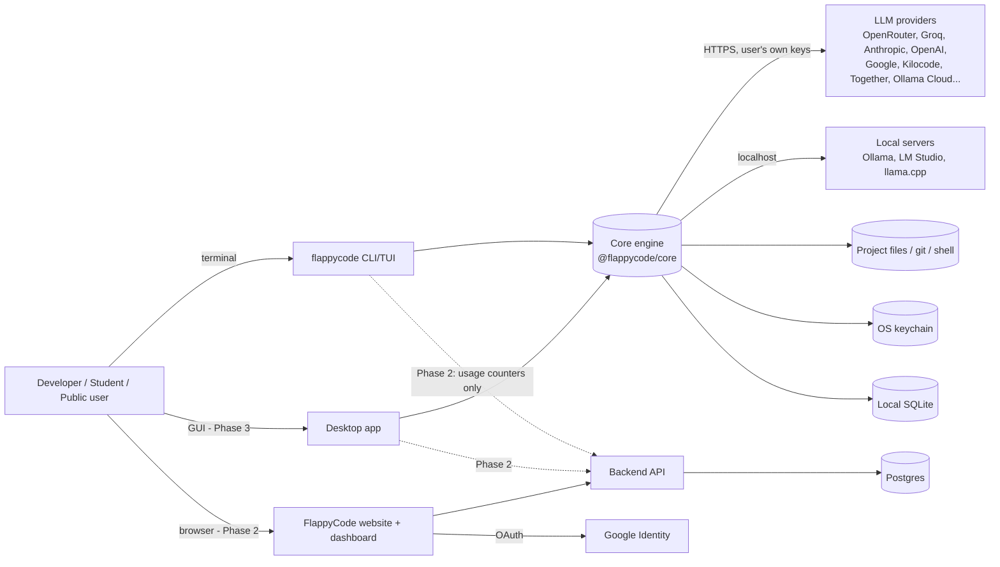
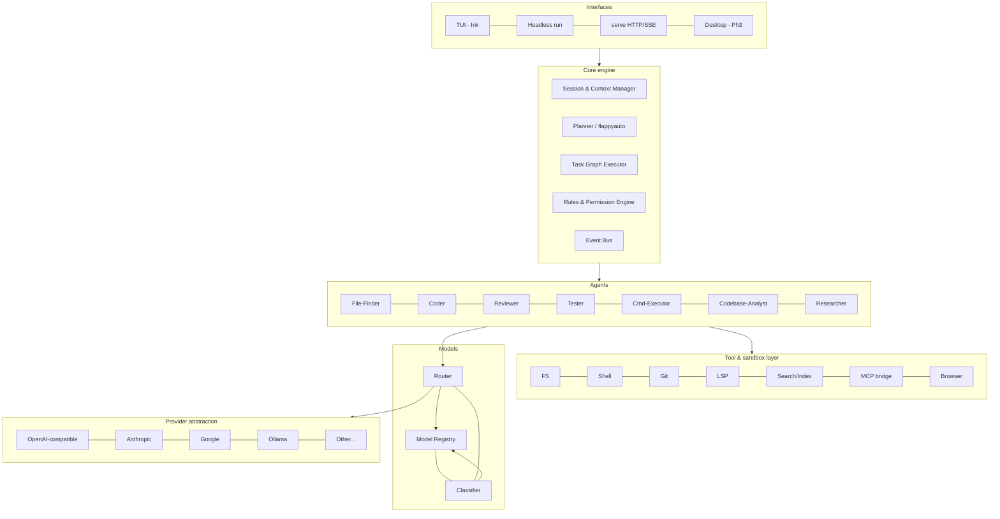
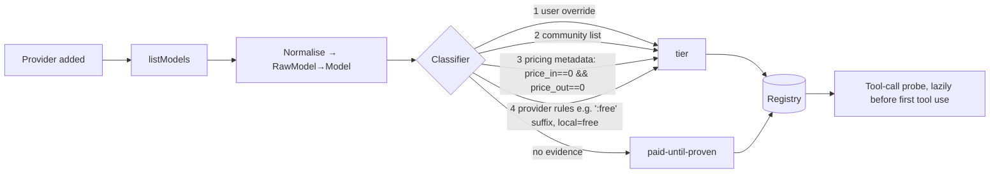
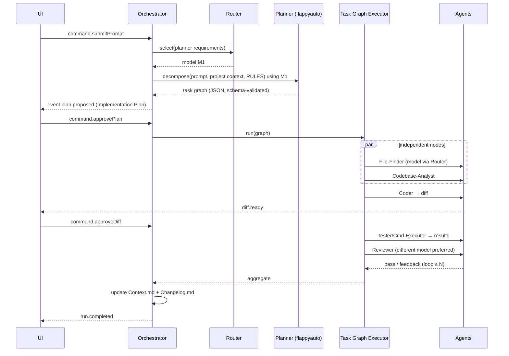
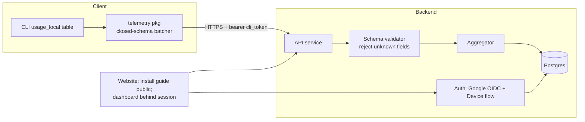
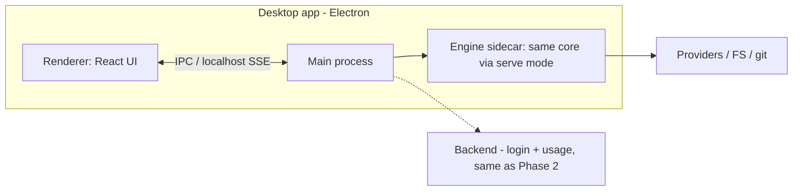

# FlappyCode — System Architecture

| | |
|---|---|
| **Document** | System Architecture |
| **Version** | 1.0 (draft for team review) |
| **Date** | 29 September 2026 |
| **Related** | `PRD.md`, `SRS.md`, `CLIDesign.md`, `TaskBreakdown.md` |

This document is written **for all three phases at once**. Phase 1 is built in full detail; Phase 2 and 3 are designed now so that Phase 1 code does not need rewriting later.

---

## 1. Architecture principles

1. **Engine as a library, clients on top.** All intelligence lives in `@flappycode/core`. CLI, `serve` mode and the Phase 3 desktop app are thin clients that send *commands* and render *events*.
2. **Event-sourced UI.** The engine emits a typed event stream (`plan.proposed`, `node.started`, `model.substituted`, `diff.ready`, `approval.requested`, …). Every UI renders that stream. This is what makes CLI ↔ desktop parity cheap.
3. **Local-first.** State in SQLite + files on the user's machine. Nothing leaves except calls to providers the user configured.
4. **Safety in the tool layer, not in prompts.** Plan-approval, permissions and secret redaction are enforced by code guards. Prompts only *inform* the model.
5. **Never silently pay.** The router's type system makes paid selection impossible without an explicit `PaidGrant` token.
6. **Connectors are plug-ins.** Each provider is an isolated module behind one interface; provider churn cannot break the core.
7. **Privacy by construction (Phase 2).** Telemetry is a separate module with a closed-schema, and the code path that has access to prompts has no network access to it.

## 2. System context



Dotted arrows are Phase 2+. There is **no arrow from the engine to the backend that carries prompts, code, or keys**.

## 3. Logical layers



## 4. Repository and package layout

Monorepo (pnpm workspaces + Turborepo). Only **one** package is published for end users — `flappycode` — which bundles the others, so `npm install -g flappycode` "just works".

```
flappycode/
├─ packages/
│  ├─ protocol/        # shared TS types: Commands, Events, config schema (zod)
│  ├─ core/            # engine: orchestrator, agents, router, registry, rules, tools
│  ├─ providers/       # connectors (one folder each) + catalog/community override loader
│  ├─ storage/         # SQLite access, migrations, keychain/secret store
│  ├─ tui/             # Ink components/screens (CLIDesign.md)
│  ├─ cli/             # published package "flappycode" (bin: flappycode) — bundles all above
│  ├─ server/          # HTTP/SSE wrapper of core (Phase 1 P1; used by Phase 3)
│  ├─ telemetry/       # Phase 2: closed-schema usage reporter
│  └─ desktop/         # Phase 3
├─ apps/
│  └─ web/             # Phase 2: website + dashboard + API
├─ rules/RULES.md      # shipped universal ruleset (+ category rule files)
├─ docs/
└─ .github/workflows/
```

## 5. Distribution — how `npm install -g flappycode` works

| Item | Decision |
|---|---|
| Package name | `flappycode` (registry lookup on 29 Sep 2026 returned "not found" — **claim it on Day 1**). |
| Runtime | Node.js ≥ 20 (`engines` field). Bundled with **tsup/esbuild** into a small number of ESM files; `bin: { "flappycode": "dist/cli.js" }` with `#!/usr/bin/env node`. |
| Native deps | Only ones with **prebuilt binaries**: `better-sqlite3`, `@napi-rs/keyring`. If keyring fails to load, fall back to encrypted file store. No node-gyp compile at install time (NFR-POR-002). |
| Assets | `RULES.md`, community model list snapshot, logo asset bundled in the package. |
| Updates | `flappycode upgrade` (wraps `npm i -g flappycode@latest`) + passive, disableable version check. |
| CI release | GitHub Actions: build → test matrix (win/mac/linux × Node 20/22) → `npm pack` install-test → `npm publish --provenance`. |
| Fallback (post-Phase 1) | Standalone single-file executables (Bun/`pkg`) and Homebrew/Scoop/winget for users without Node. Needed for Phase 3 public users anyway. |

## 6. Core component design

### 6.1 Provider abstraction layer

```ts
interface ProviderConnector {
  readonly type: string;                       // "openai-compatible" | "anthropic" | "google" | "ollama" ...
  authenticate(cfg: ProviderConfig): Promise<AuthResult>;
  listModels(): Promise<RawModel[]>;           // provider-native catalog
  complete(req: CompletionRequest): AsyncIterable<CompletionChunk>; // streaming, tool calls normalised
  getQuota?(): Promise<QuotaInfo | "unknown">; // optional
  healthCheck(): Promise<HealthInfo>;
}
```
- **Normalised schema:** messages, tool definitions and tool calls are translated to one internal format; connectors convert to/from provider-native.
- **Implementation shortcut (ADR-003):** use the **Vercel AI SDK** provider packages (`@ai-sdk/openai-compatible`, `@ai-sdk/anthropic`, `@ai-sdk/google`, `ollama-ai-provider`) for streaming + tool-call normalisation, wrapped in our `ProviderConnector`. This saves days in a 26-day Phase 1 and keeps us free to replace the SDK per provider later.
- One **OpenAI-compatible** connector class covers OpenRouter, Groq, Together, Fireworks, Kilocode, LM Studio, llama.cpp, with a small per-provider "profile" (base URL, discovery path, pricing parser, quirks). *Each provider's discovery endpoint and free-tier signals must be verified during Task 1.x before relying on them.*
- Rate limiting: token-bucket + concurrency semaphore per provider; honours `Retry-After`.

### 6.2 Model discovery and classifier


- Local models (Ollama/LM Studio/llama.cpp) are `free` by definition (cost = user hardware) and flagged `local`.
- `rate-limited-free` is assigned when the provider documents limits (community list or profile).
- Catalog source: bundled snapshot of a community model database (e.g., models.dev-style JSON) refreshed at most daily via read-only fetch, merged under provider-native data.

### 6.3 Model Registry and Router

**Registry** = SQLite `model` table + in-memory index; live state (busy count, cooldown-until, recent error rate) is in memory.

**Router algorithm** (deterministic, no learned grades):

```ts
function select(req: TaskRequirements, ctx: RouterContext): Selection | PoolExhausted {
  // 0. pinned binding wins
  if (ctx.agent.binding && ctx.agent.binding !== 'flappyauto' && !isAuto(ctx.agent.binding)) {
    const m = registry.get(ctx.agent.binding);
    if (available(m)) return use(m);
    return applyFallbackPolicy(ctx.agent);      // default: ask user
  }
  // 1. candidate filter (hard requirements)
  let c = registry.enabled()
      .filter(m => m.tier in FREE_TIERS)                    // paid is NOT a candidate (PaidGrant needed)
      .filter(m => m.context >= req.minContext)
      .filter(m => !req.tools  || (m.supportsTools  && m.toolProbe !== 'failed'))
      .filter(m => !req.vision || m.supportsVision)
      .filter(m => available(m));                            // not cooling-down, under concurrency cap, quota not exhausted
  // 2. score (soft preferences) — transparent weights, unit-testable
  score(m) = w1*taskAffinity(m, req.taskType)   // e.g. large-context for analyst, strong-coder for Coder, fast for File-Finder
           + w2*headroom(m)                     // remaining quota / concurrency
           + w3*latencyScore(m)
           + w4*localBonus(m, ctx.privacyMode)
           - w5*recentErrorRate(m)
           - w6*sameAsCoderPenalty(m, ctx, req.role === 'reviewer');
  // 3. pick best; return ranked list so callers can fall through
  if (c.length === 0) return PoolExhausted(req);
  return rank(c);                                         // caller iterates on failure
}
```
- `taskAffinity` comes from **declared** metadata (model family/size/context/tool support and a small maintained "role hints" table), not from measured quality grades (FR-RTE-002).
- **Paid gate:** `Selection<Paid>` can only be constructed with a `PaidGrant` (issued by (a) user explicitly pinning a paid model, or (b) user acting on a pool-exhaustion notice). No grant → compile-time and runtime impossible.
- **Pool exhaustion** raises an `approval.requested{kind:'pool_exhausted'}` event with exactly two actions; the run stays paused, state persisted.

### 6.4 Orchestrator and `flappyauto`


- Task graph = DAG; executor is a simple topological scheduler with a global concurrency limit and per-provider limits.
- **Plan gate:** the plan approval issues a signed, run-scoped `PlanToken`. Write/delete tools require a valid token; the token lists allowed paths/operations from the plan, so an agent cannot exceed the approved scope without a new approval.
- Single-model mode (`--model X` or picking a model): the planner is skipped; one agent loop runs with all tools, same guards.

### 6.5 Agent runtime

Each agent = `{ systemPrompt, allowedTools, modelRef, fallbackPolicy }` + the shared `RULES.md` block. Loop:

```
while (!done && steps < maxSteps):
   response = model.complete(messages, tools = allowedTools)
   for each toolCall: result = toolLayer.invoke(call)   // guards: permissions, plan token, redaction
   append tool results (verbatim) → messages
```
- Tool results are stored verbatim (no fabricated outcomes; FR-RUL-006).
- Context Manager builds a **per-agent context slice** and compacts when > 80 % of the model's window.
- Custom agents are YAML/Markdown files in `.flappycode/agents/` (validated by schema).

### 6.6 Rules and permission engine

| Component | Responsibility |
|---|---|
| **RulesLoader** | Loads shipped `RULES.md` + category sections (repo-type detection: package.json deps, file layout) + project and nested overrides; detects conflicts. |
| **PromptComposer** | Injects rules + agent prompt + context into every model call. |
| **PlanGate** | Issues/validates `PlanToken`; blocks write/delete. |
| **PermissionEngine** | Evaluates each tool call against `deny → ask → allow` pattern lists and tiers; emits `approval.requested`; remembers per-project "always allow" rules. |
| **DocsKeeper** | After an approved change set, creates/updates `Context.md` and appends to `Changelog.md`. |
| **SecretGuard** | Redacts known secret values / patterns in tool output and blocks committing files containing secrets. |
| **StopConditions** | Detects destructive ops, breaking-API changes, migrations → forces approval. |

### 6.7 Tool and sandbox layer

| Tool | Notes |
|---|---|
| FS | Root-jailed; `realpath` canonicalisation; symlink escape blocked; all writes via patch objects for undo. |
| Shell | `execa`-style spawn, no shell interpolation of model text without parsing; timeouts, output caps; Windows: PowerShell/cmd aware. Allow/ask/deny lists. Optional Docker runner (`sandbox.mode: "docker"`). **Honest limitation:** without Docker, Windows/macOS sandboxing = policy + approvals, not kernel isolation. |
| Git | Uses system `git`; never force-push; protected branch guard. |
| Search | ripgrep (bundled binary or JS fallback) for lexical; semantic index (embedding via any embedding-capable connected model or local model) in P1. |
| LSP | Spawn per-language server if installed (P1). |
| MCP | Official SDK client; tools wrapped by PermissionEngine (P1). |
| Browser | Playwright, isolated profile (P2). |

### 6.8 Context, memory and storage

- **SQLite** (`better-sqlite3`, WAL) at `~/.local/share/flappycode/flappycode.db` (Windows `%LOCALAPPDATA%`). Schema in `SRS.md` §6.1. Migrations via numbered SQL files.
- **Secrets:** keychain entry per provider (`service=flappycode, account=provider:<id>`); fallback AES-256-GCM file.
- **Undo:** each approved batch stores a reversible patch; git repos additionally checkpoint via `git stash create`.
- **Files written into projects:** `Context.md`, `Changelog.md`, optional `.flappycode/` (agents, config, permissions).

### 6.9 Event bus and protocol (`packages/protocol`)

Commands (client → engine): `submitPrompt`, `approvePlan`, `rejectPlan`, `approveDiff`, `answerQuestion`, `grantPermission`, `cancelRun`, `addProvider`, `refreshProviders`, `pinModel`, `resolvePoolExhausted{action}`.
Events (engine → client): `session.started`, `plan.proposed`, `node.started/updated/finished`, `model.selected`, `model.substituted`, `diff.ready`, `approval.requested`, `question.asked`, `pool.exhausted`, `provider.status`, `registry.updated`, `run.completed/failed`, `log`.
All are zod-validated types; the in-process bus and the `serve` SSE stream carry the same payloads (FR-INT-003).

### 6.10 `serve` mode (Phase 1 P1 → required by Phase 3)
`flappycode serve` → HTTP on `127.0.0.1:<port>`; `POST /v1/commands`, `GET /v1/events` (SSE), `GET /v1/registry`, `GET /openapi.json`; per-launch bearer token; no CORS by default.

## 7. Security architecture

| Threat | Control |
|---|---|
| Prompt injection via files/web/tool output | Untrusted-content framing; permissions and plan token are code-enforced and cannot be altered by model text; destructive actions need human approval. |
| Malicious/buggy model runs dangerous commands | Deny/ask/allow lists; approval per command; timeouts; optional Docker. |
| Path traversal / symlink escape | Canonical path checks in FS tool. |
| Key leakage | Keychain; never in prompts; redaction filter; logs scrubbed; never sent to FlappyCode servers. |
| Supply chain | Lockfile, `npm audit`, provenance-signed publish, minimal deps. |
| Local server abuse | Loopback + bearer token, no CORS. |
| Data-use surprise | Per-provider "trains on prompts" label; option to exclude such providers per project (`privacyMode`). |

## 8. Phase 2 architecture — accounts and usage dashboard



| Topic | Decision |
|---|---|
| Web/API stack | **Next.js (App Router) + Auth.js (Google provider)** for site, dashboard and API routes; **Postgres** (managed, e.g., Neon/Supabase, or university-hosted); ORM: Drizzle/Prisma. One deployable, easy to hire/maintain (ADR-005). |
| CLI linking | RFC 8628 Device Authorization: `flappycode login` → user code + URL → browser approval → opaque token (hash stored) → keychain. |
| Reporting | `usage_local` aggregated per (provider, model, day) → batched POST every ≥ 5 min with idempotency key; offline queue; only fields of SRS §6.3. |
| Privacy enforcement | (1) client: typed payload builder with no string fields except validated aliases/model ids; (2) server: strict schema (`additionalProperties:false`), reject-and-alert on violation; (3) CI test that greps outbound payload fixtures for canary strings planted in prompts/files; (4) `telemetry show` command; (5) client open source. |
| Quota "remaining" | Provider API when available; else derived from provider-documented limit minus locally counted usage → flagged `remaining_is_estimate`. |
| Scale (university) | Stateless API behind CDN/LB; write path is tiny (counters). Rate limit per token; DB indices on `(account_id, date)`; load test to 10× the expected user count. |
| Ops | Structured logs (no user content exists to leak), uptime monitor, DB backups, runbook, deletion job (≤ 24 h). |
| Access control | Optional Google Workspace `hd` domain restriction (PRD OQ-2). |

## 9. Phase 3 architecture — desktop application


- **Electron** chosen for v1 (ADR-006): the engine is TypeScript, so main process can host it directly or as a child process running `serve` mode; single toolchain, fastest path to public launch. Re-evaluate Tauri (+ Node sidecar) if installer size becomes a blocker.
- The renderer only speaks the `protocol` Commands/Events — the same as `tui`. UI components (diff viewer, approvals, task-graph) are new, but **no engine changes** are needed.
- Shared config/registry/sessions with CLI via the same data directories (FR-DSK-005); a lock/lease prevents two engines writing the same session.
- Packaging: electron-builder, code signing (Windows Authenticode, Apple notarisation), auto-update (with consent).

## 10. Technology stack summary

| Layer | Choice | Why |
|---|---|---|
| Language | TypeScript (strict) | Provider SDK ecosystem; shared across CLI, server, web, desktop. |
| TUI | Ink (React for terminals) | Component model matches later GUI; mature; Windows-compatible. |
| Build | pnpm + Turborepo + tsup | Fast monorepo builds, single bundled npm package. |
| Validation | zod | One schema source for config, protocol, planner output. |
| LLM plumbing | Vercel AI SDK (wrapped) | Streaming/tool-call normalisation for many providers. |
| Storage | SQLite (better-sqlite3), OS keychain (`@napi-rs/keyring`) | Zero-ops, local-first. |
| Search | ripgrep; optional embeddings | Fast lexical first. |
| Tests | Vitest, ink-testing-library, msw/recorded fixtures, Playwright (web/desktop) | |
| CI/CD | GitHub Actions | Matrix incl. Windows. |
| Phase 2 | Next.js, Auth.js, Postgres, Drizzle | Section 8. |
| Phase 3 | Electron, React, electron-builder | Section 9. |

## 11. Architecture decision records

| ADR | Decision | Alternatives | Rationale |
|---|---|---|---|
| 001 | TypeScript on Node ≥ 20, bundled with tsup | Go; Bun-compiled binaries | npm-native install like OpenCode, best SDK availability, shared code with web/desktop. Standalone binaries added later. |
| 002 | Ink for TUI | Bubble Tea (Go), blessed | Same language; React model reusable in mental model for desktop. |
| 003 | Wrap Vercel AI SDK in own `ProviderConnector` | Hand-write all connectors | Time; replaceable per provider. |
| 004 | Deterministic router with declared-capability scoring; no learned grades | Benchmark grading | Spec §2.7/§4.15 binding decision. |
| 005 | Next.js + Auth.js + Postgres for Phase 2 | Separate SPA + Express | Single deployable, quick to ship. |
| 006 | Electron for Phase 3 v1 | Tauri | Reuse TS engine; speed. Revisit for size. |
| 007 | Safety enforced in tool layer (PlanToken, PermissionEngine) | Prompt-only rules | Models (esp. free ones) are unreliable rule-followers. |
| 008 | Telemetry as isolated, closed-schema module, Phase 2 only | Analytics SDK | Privacy guarantee must be verifiable. |
| 009 | Local SQLite + `usage_local` from day 1 | Add metering later | Phase 2 dashboard needs history from Phase 1 dogfooding; costs almost nothing. |

## 12. Cross-cutting concerns

- **Testing strategy:** mock-provider harness (scriptable fake LLM: rate limits, malformed output, disappearing models) drives router/orchestrator integration tests; recorded-response contract tests per connector; end-to-end "golden tasks" against a sample repo using a local small model in CI nightly.
- **Observability:** local structured logs (`--debug`), `doctor`; no remote telemetry in Phase 1.
- **Configuration precedence:** CLI flags > project `.flappycode/config.json` > user config > defaults.
- **Extensibility hooks reserved now:** agent definition files, MCP client, plugin interface (`registerTool`) — interfaces stubbed in Phase 1 even where features are P1/P2.
- **Versioning:** semver; config and DB schemas carry `schemaVersion` with forward migrations.
