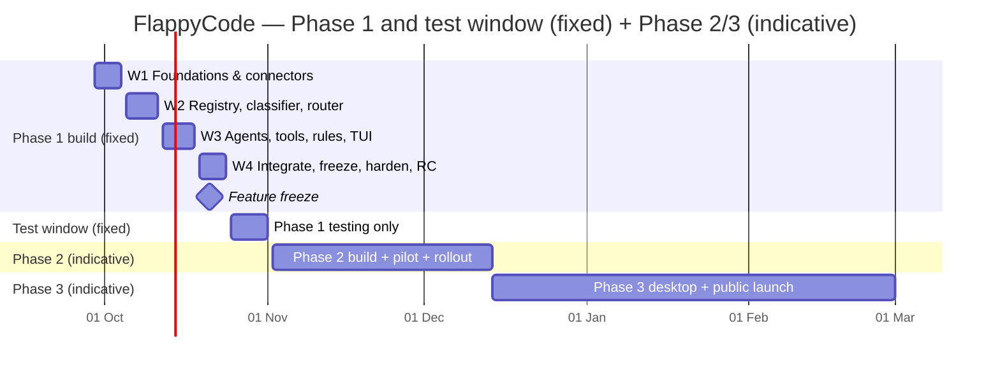

# FlappyCode — Phase-wise Task Breakdown, Checklist and Timeline

| | |
|---|---|
| **Document** | Task Breakdown & Timeline |
| **Version** | 1.0 (draft for team review) |
| **Date** | 29 September 2026 (Tuesday) |
| **Related** | `PRD.md`, `SRS.md`, `SystemArchitecture.md`, `CLIDesign.md` |

**How to use this file:** every task is a checkbox — tick `[x]` as you finish. Format: `ID — task — estimate (person-days, "d") — due`. Priority: **P0** must ship in the phase · **P1** if capacity allows · **P2** deferrable. Replace `@owner` with a name.

---

## 1. Master timeline

| Window | Dates | Goal |
|---|---|---|
| **Phase 1 build** | Tue **29 Sep → Sat 24 Oct 2026** (Phase 1 must be done *before* 25 Oct) | Core CLI engine, used by the founding team |
| **Phase 1 test-only window** | Sun **25 Oct → Sun 1 Nov 2026** | Testing and bug-fixing only. No new features |
| **Phase 2** | From Mon **2 Nov 2026** — no fixed end date (indicative ≈ 6 weeks, see §5) | Accounts + dashboard; **whole university** uses it |
| **Phase 3** | Starts after Phase 2 stabilises — no fixed end date (indicative ≈ 10–12 weeks, see §6) | Desktop app + **public launch** |

### Key milestones and checkpoints

- [ ] **M0 — Thu 1 Oct:** repo, CI, npm name claimed, event/config schemas agreed
- [ ] **M1 — Sun 4 Oct:** `flappycode` launches home screen; one provider connected; a completion streams
- [ ] **M2 — Sun 11 Oct:** multi-provider discovery → classified pool → router → status bar & model picker live
- [ ] **Checkpoint — Mon 12 Oct:** scope review; apply cut ladder (§2.4) if any stream is > 1.5 d behind
- [ ] **M3 — Sun 18 Oct:** end-to-end `flappyauto` run: plan approval → agents → diff approval → docs updated
- [ ] **M4 — Wed 21 Oct:** **Feature freeze** (P0 complete; only P1 already in flight may land)
- [ ] **M5 — Sat 24 Oct:** `flappycode@0.1.0-rc.1` published to npm; install-tested on Windows/macOS/Linux
- [ ] **T0 — Sun 25 Oct:** test window opens
- [ ] **T-exit — Sun 1 Nov:** exit review; Phase 1 accepted; Phase 2 plan confirmed

---

## 2. Phase 1 — Core orchestration engine (CLI)

### 2.1 Assumptions and honest capacity check
- **Team assumed: 4 engineers**, working ~5 productive days per week (≈ 21 working days each, 29 Sep → 24 Oct).
- **P0 estimate ≈ 77 person-days** vs **≈ 84 available** → ~92 % utilisation, i.e. **almost no slack**. With **3 engineers this does not fit** — apply the cut ladder in §2.4 from day 1, or extend the team.
- Public holidays are *not* subtracted. Please check local holidays (I recall Dussehra around 20 Oct and Diwali around 8 Nov 2026 — verify these) and adjust.
- UI screens (stream 4) are built against **recorded event fixtures** so the TUI is not blocked by the engine.
- Until the real router lands (W2/W3), the orchestrator uses a `StubRouter` (static model pin) — keeps stream 2 unblocked.
- All engineers write tests for their own code; the dedicated QA time is in §3.

**Streams (suggested owners):**
| Stream | Scope | Owner |
|---|---|---|
| **S1** Providers, Registry, Router | connectors, discovery, classifier, router, fallback | @owner |
| **S2** Orchestration, Agents, Rules | planner/flappyauto, executor, agents, context, `RULES.md` gates | @owner |
| **S3** Foundation, Tools, Safety | monorepo, CI, schemas, storage, secrets, FS/shell/git/permissions | @owner |
| **S4** TUI, CLI, Release, Docs | Ink UI per `CLIDesign.md`, commands, packaging, docs | @owner |

### 2.2 Week 1 — Tue 29 Sep → Sun 4 Oct: Foundations and first provider

**S3 — Foundation** (~5.25 d)
- [ ] **P1-A1** (P0) Claim npm package `flappycode` (registry showed it free on 29 Sep), GitHub repo, licence (Apache-2.0/MIT — OQ-5) — 0.25 d — **29 Sep**
- [ ] **P1-A2** (P0) Monorepo scaffold: pnpm + Turborepo, strict TS, ESLint/Prettier, Vitest — 1 d — 30 Sep
- [ ] **P1-A3** (P0) CI: GitHub Actions matrix (Windows/macOS/Linux × Node 20/22): lint, test, build — 1 d — 1 Oct
- [ ] **P1-A5** (P0) `protocol` package: zod schemas for Commands, Events, config, task graph — 1.5 d — 1 Oct (**M0**)
- [ ] **P1-A6** (P0) `storage`: SQLite (WAL), migrations, schema v1 from SRS §6.1 incl. `usage_local` — 1.5 d — 3 Oct

**S1 — Providers** (~5 d)
- [ ] **P1-B1** (P0) `ProviderConnector` interface + **mock provider harness** (scriptable rate limits, 5xx, malformed output, vanishing models) — 1.5 d — 30 Sep
- [ ] **P1-B2** (P0) OpenAI-compatible connector on Vercel AI SDK (streaming + tool calls) — covers OpenRouter, Groq, Together, Fireworks, Kilocode, LM Studio, Ollama `/v1`, llama.cpp — 2 d — 2 Oct
- [ ] **P1-B3** (P0) **Verify** discovery endpoints, free-tier signals and ToS for day-one providers (OpenRouter, Groq, Together, Kilocode, Ollama Cloud, Google AI Studio, Anthropic, OpenAI); write provider profiles + data-use labels — 1.5 d — 4 Oct

**S2 — Orchestration/Rules** (~4.5 d)
- [ ] **P1-F1** (P0) Author `RULES.md` (universal) + category rule files; `RulesLoader` with nested-override + conflict detection — 2 d — 2 Oct
- [ ] **P1-D1** (P0) Declarative agent definition loader + agent runtime loop (tool loop, verbatim tool results) — 2 d — 3 Oct
- [ ] **P1-F2** (P0) `PromptComposer` (rules + agent prompt + context) — 0.5 d — 4 Oct

**S4 — TUI/Release** (~4.5 d)
- [ ] **P1-A4** (P0) tsup bundling, `bin: flappycode`, `npm pack` install smoke test in CI, publish placeholder `0.0.1` — 1 d — 2 Oct
- [ ] **P1-G1** (P0) Ink app skeleton + store bound to event bus (fixture replay mode) — 1 d — 1 Oct
- [ ] **P1-G2** (P0) Logo pixel map + banner renderer (yellow/cyan letters, birds, speed lines, responsive) — 1.5 d — 3 Oct
- [ ] **P1-G3** (P0) Home screen zones A–E (static data) — 1 d — 4 Oct

**Exit:** ☐ **M0** (1 Oct) ☐ **M1** (4 Oct): home screen renders; one provider streams a completion.

### 2.3 Week 2 — Mon 5 Oct → Sun 11 Oct: Pool, classifier, router

**S1 — Registry & Router** (~5 d)
- [ ] **P1-B6** (P0) Discovery + normalisation → registry writes; provider-add triggers discovery — 1.5 d — 7 Oct
- [ ] **P1-B7** (P0) Classifier (override > community list > pricing metadata > rules; *paid-until-proven*) + community override list loader — 1.5 d — 8 Oct
- [ ] **P1-C1** (P0) Router: candidate filter, scoring, ranking (declared capabilities only) — 2 d — 10 Oct

**S3 — Storage/Tools** (~5.5 d)
- [ ] **P1-A7** (P0) Secret store: OS keychain + AES-256-GCM encrypted-file fallback — 1.5 d — 6 Oct
- [ ] **P1-A8** (P0) Config loader (precedence, `env:` refs, schema validation) — 1 d — 7 Oct
- [ ] **P1-E1** (P0) Filesystem tool: project jail, canonical paths, patch-based writes, undo store — 2 d — 9 Oct
- [ ] **P1-E5** (P0) Search tool (ripgrep + JS fallback) — 1 d — 10 Oct

**S2 — Orchestration** (~5 d)
- [ ] **P1-D2** (P0) Planner / `flappyauto`: prompt, task-graph JSON schema, validate + one repair attempt — 2 d — 8 Oct
- [ ] **P1-D3** (P0) Task graph executor: topo schedule, parallel + sequential, concurrency limits, cancel — 2 d — 10 Oct
- [ ] **P1-D6** (P0) Context manager: per-agent slices, compaction at ~80 % window — 1 d (+0.5 in W4) — 11 Oct

**S4 — TUI** (~5 d)
- [ ] **P1-G4** (P0) Provider wizard (masked key, validate, discovery summary) + first-run onboarding card — 2 d — 8 Oct
- [ ] **P1-G5** (P0) Live status bar (counts, states) — 0.5 d — 8 Oct
- [ ] **P1-G6** (P0) Model picker with `flappyauto` first; bind-to-agent — 1.5 d — 10 Oct
- [ ] **P1-G7a** (P0) `providers` / `models` / `--version` subcommands — 1 d — 11 Oct

**Exit:** ☐ **M2** (11 Oct): add ≥ 2 providers → pool visible in `/models` and status bar; router returns ranked models against mocks; 0 paid selections in tests.
**Mon 12 Oct checkpoint:** ☐ scope review completed; ☐ cut ladder decision recorded.

### 2.4 Cut ladder (apply in this order if behind — decide on 12 Oct)
1. Native Anthropic/Google connectors (**P1-B5**) → use their OpenAI-compatible endpoints instead.
2. Extra slash commands / `@file` picker polish (part of **P1-G11**).
3. Native Ollama/LM Studio polish (**P1-B4**) — local already works via OpenAI-compatible profile; keep auto-detect.
4. Session **resume** (**P1-D7**) → move to test window.
5. Context compaction → simple truncation *with visible warning* (temporary deviation from FR-CTX-002; log as known gap).
6. **Never cut:** plan gate, permission engine, paid-gate/pool-exhausted notice, secret handling, diff approval, undo.

### 2.5 Week 3 — Mon 12 Oct → Sun 18 Oct: Agents, tools, rules, run screens

**S1 — Router hardening** (~5 d)
- [ ] **P1-C2** (P0) Fallback iteration, cooldowns, `Retry-After`, exponential backoff + jitter — 1 d — 13 Oct
- [ ] **P1-C3** (P0) `PaidGrant` gate + `pool.exhausted` event + resume logic — 1 d — 14 Oct
- [ ] **P1-B8** (P0) Registry live state + periodic re-validation (6 h), `unavailable` marking, `providers refresh` — 1.5 d — 16 Oct
- [ ] **P1-B9** (P0) Per-provider rate limiter + concurrency semaphore — 1.5 d — 17 Oct
- [ ] Swap `StubRouter` → real router in orchestrator — (in D-tasks) — **16 Oct**

**S2 — Agents & Rules** (~5 d)
- [ ] **P1-D4** (P0) Specialist agents: File-Finder, Coder/Editor, Tester/Command-Executor, Reviewer — 2.5 d — 15 Oct
- [ ] **P1-D5** (P0) Coder ↔ Reviewer/Tester feedback loop (max 3 iterations) — 1 d — 16 Oct
- [ ] **P1-F3** (P0) `PlanGate` + run-scoped `PlanToken`; write/delete tools locked without it — 1.5 d — 18 Oct

**S3 — Tools & Safety** (~5 d)
- [ ] **P1-E2** (P0) Shell tool: timeouts, output caps, PowerShell/cmd/sh handling — 1.5 d — 14 Oct
- [ ] **P1-E3** (P0) `PermissionEngine`: deny/ask/allow, tiers, "always allow in project" — 2 d — 16 Oct
- [ ] **P1-E4** (P0) Git tool: status/diff/branch/commit; push & force guards — 1.5 d — 18 Oct

**S4 — TUI** (~5 d)
- [ ] **P1-G8** (P0) Plan approval screen — 1 d — 14 Oct
- [ ] **P1-G9** (P0) Live task graph / run view (substitution indicator) — 1.5 d — 16 Oct
- [ ] **P1-G10** (P0) Diff review, permission prompt, clarifying question, **pool-exhausted** screens — 2.5 d — 18 Oct

**Exit:** ☐ **M3** (18 Oct): on a sample repo, `flappyauto` completes "fix the failing test" end-to-end with plan approval, diff approval and permission prompts.

### 2.6 Week 4 — Mon 19 Oct → Sat 24 Oct: Integrate, freeze, harden, release candidate

**S1** (~4.5 d)
- [ ] **P1-C4** (P0) Router unit + property + chaos tests (rate-limit storms, vanishing models, all-exhausted) — 1.5 d — 20 Oct
- [ ] **P1-B4** (P0/cuttable) Native Ollama (`/api/tags`), LM Studio, llama.cpp: auto-detect + discovery polish — 1.5 d — 21 Oct
- [ ] **P1-B5** (P0/cuttable) Native Anthropic + Google connectors — 1 d — 21 Oct
- [ ] **P1-B12** (P0) Record `usage_local` (per provider/model/day requests, tokens, active minutes) — 1 d — 22 Oct

**S2** (~4.5 d)
- [ ] **P1-F4** (P0) `DocsKeeper`: create/update `Context.md`, append `Changelog.md` after each approved change set — 1 d — 20 Oct
- [ ] **P1-F5** (P0) `StopConditions` (destructive ops, breaking API, migrations, rule conflicts) — 1 d — 20 Oct
- [ ] **P1-D7** (P0/cuttable) Session persistence + resume — 1 d — 21 Oct
- [ ] Integration with real router, error paths, cancel/undo hardening — 1.5 d — 22 Oct

**S3** (~4 d)
- [ ] **P1-E6** (P0) `SecretGuard`: output redaction, block committing secrets — 1 d — 20 Oct
- [ ] **P1-J1** (P0) Golden-task harness: 20-task benchmark repo set + scripted runner (used in test window) — 2 d — 22 Oct
- [ ] **P1-J2** (P0) Security tests: path traversal, symlink escape, deny-list bypass, prompt-injection fixtures — 1 d — 22 Oct

**S4** (~4.5 d)
- [ ] **P1-G11** (P0) Completion summary, slash commands (`/models /agents /providers /plan /undo /diff /status /rules /help`), history, `@file` mention — 1.5 d — 21 Oct
- [ ] **P1-G7b** (P0) `config`, `doctor`, `agents`, `sessions` commands — 0.5 d — 21 Oct
- [ ] **P1-I1** (P0) README, quickstart, provider setup guides, `RULES.md` explainer, known limitations — 1.5 d — 23 Oct
- [ ] **P1-I2** (P0) Release pipeline (provenance publish), install-test on 3 OSes, publish **`0.1.0-rc.1`** — 1 d — **24 Oct**

**P1 backlog — only after all P0 are green, in this order (deadline: freeze 21 Oct; anything unfinished moves to Phase 2 "carry-over"):**
- [ ] **P1-H1** (P1) Headless `flappycode run` (`--json`, `--approve-plan`, exit codes) — 1.5 d *(recommended first: enables CI-driven testing)*
- [ ] **P1-H2** (P1) `flappycode serve` HTTP/SSE + OpenAPI (needed for Phase 3) — 2.5 d
- [ ] **P1-B10** (P1) Provider health/latency/error-rate — 1 d
- [ ] **P1-B11** (P1) Tool-call capability probe — 1 d
- [ ] **P1-D8** (P1) Codebase-Analyst agent + semantic index — 2 d
- [ ] **P1-E7** (P1) LSP diagnostics — 2 d
- [ ] **P1-E8** (P1) MCP client — 2 d
- [ ] **P1-F6** (P1) Category-specific rule activation (repo-type detection) — 1 d
- [ ] **P1-D9** (P1) Reviewer prefers a different model than Coder — 0.5 d
- [ ] **P2 (deferred by default):** Researcher/Browser agent, vision/screenshot input, plugin system, MCP server, IDE extensions

### 2.7 Phase 1 Definition of Done (verify on 24 Oct, confirm by 1 Nov)
- [ ] `npm install -g flappycode` then `flappycode` works on Windows (PowerShell), macOS, Linux
- [ ] Home screen matches mockup zones A–E (`CLIDesign.md` §11 checklist)
- [ ] Add ≥ 3 providers incl. one local; pool + status counts correct
- [ ] `flappyauto` default; single-model mode works; per-agent binding works
- [ ] Zero paid calls in all pool-exhaustion tests; notice shows exactly two actions
- [ ] No file write/delete possible without approved plan (automated test)
- [ ] `Context.md` and `Changelog.md` maintained after each change set
- [ ] No API key appears in prompts, logs or outbound traffic (automated test)
- [ ] Undo restores prior state
- [ ] README + quickstart published

---

## 3. Phase 1 test-only window — Sun 25 Oct → Sun 1 Nov 2026

**Rules:** no new features. Fix Sev-1 (data loss, security, cannot install/run) and Sev-2 (major flow broken) only; Sev-3/4 are logged for Phase 2. Daily 15-min triage.

**Sun 25 Oct — Install & smoke**
- [ ] Fresh-machine install on Windows 10/11, macOS, Ubuntu (clean VMs)
- [ ] `flappycode --version`, `doctor`, home screen, provider add

**Mon 26 Oct — Golden tasks I**
- [ ] Run the 20-task benchmark with `flappyauto`
- [ ] Record success rate, time, models used, substitutions

**Tue 27 Oct — Golden tasks II**
- [ ] Repeat with single-model mode and per-agent bindings
- [ ] Repeat with a local-only model
- [ ] Compare against the Phase 1 target (≥ 60 %)

**Wed 28 Oct — Safety & security**
- [ ] Path traversal, symlink and deny-list tests
- [ ] Prompt-injection fixtures in repo files
- [ ] Verify the plan gate cannot be bypassed
- [ ] Secrets never in logs/prompts (grep + network capture)

**Thu 29 Oct — Chaos & fallback**
- [ ] Force rate limits, provider outages, vanishing models
- [ ] Exhaust the free pool → notice shown; confirm **0 paid calls**
- [ ] Task resumes after adding a provider

**Fri 30 Oct — UX & terminals**
- [ ] Layout at 60/80/120 columns
- [ ] Windows Terminal, PowerShell 5/7, cmd, iTerm2, GNOME Terminal, tmux, SSH
- [ ] `NO_COLOR`, ASCII and plain modes

**Sat 31 Oct — Dogfood & fixes**
- [ ] Whole team uses FlappyCode on real work all day
- [ ] Fix the Sev-1/2 backlog; cut RC-2 if needed

**Sun 1 Nov — Exit review**
- [ ] Publish `0.1.0` if criteria are met
- [ ] Re-run the Definition of Done (§2.7)
- [ ] Retro; log tech debt; confirm Phase 2 scope, dates and open questions (OQ-2/3/5)

**Exit criteria (1 Nov):** 0 open Sev-1/Sev-2; benchmark ≥ 60 %; DoD all ticked; team using it daily; known-issues list published.

---

## 4. Phase 2 preview constraints already handled in Phase 1
- `usage_local` counters recorded (P1-B12) so the dashboard has history from day one.
- Event/protocol package and `serve` (P1-H2) are the base for the website/desktop.
- **No** telemetry code exists in Phase 1 — Phase 2 adds it as an isolated module.

---

## 5. Phase 2 — Accounts and usage dashboard (university rollout)

**Start:** Mon 2 Nov 2026 · **End:** not fixed. **Indicative duration ≈ 6 weeks** to full university availability (≈ mid-December 2026); align with the university calendar (exams/holidays) and confirm at the 1 Nov retro. Phase 1 bug-fix capacity (~15–20 %) continues throughout.

### 5.1 Decisions needed before / in week 1
- [ ] OQ-2 — restrict to university Google Workspace domain or open sign-in?
- [ ] OQ-3 — consent model for usage reporting (recommend explicit consent at `login`)
- [ ] OQ-5 — open-source licence + repo visibility
- [ ] Hosting: managed (Vercel + Neon/Supabase) vs university infrastructure; domain name
- [ ] Data retention period for `usage_metric` (recommend ≤ 13 months, user-deletable anytime)

### 5.2 Indicative plan

**Week 1 (2–8 Nov) — Setup & carry-over**
- [ ] **P2-01** Phase 1 retro actions + carry-over P1 items (headless `run`, `serve`, health, probe)
- [ ] **P2-02** Google Cloud OAuth client (dev + prod), consent screen, domain verification
- [ ] **P2-03** `apps/web` scaffold (Next.js + Auth.js), Postgres, Drizzle schema for `account`, `cli_token`, `usage_metric`, `session_time_log` (SRS §6.3)
- [ ] **P2-04** Staging + prod environments, CI/CD, secrets management
- [ ] **P2-05** Threat model + privacy design review (what may/may not be transmitted)

**Weeks 2–3 (9–22 Nov) — Identity & metering**
- [ ] **P2-06** Google sign-in, sessions, sign-out; public vs gated routes
- [ ] **P2-07** Device Authorization endpoints + `flappycode login/logout/whoami` + keychain token storage + revoke UI
- [ ] **P2-08** `telemetry` package: closed-schema payload builder, active-time tracker (idle > 5 min excluded), batching, offline queue
- [ ] **P2-09** Consent card at first login + `telemetry show` / `telemetry off`
- [ ] **P2-10** Server ingest: strict schema validation (`additionalProperties:false`), idempotency, rate limits, aggregation jobs
- [ ] **P2-11** Quota "remaining" logic: provider API where available; documented-limit − local usage as *estimate* flag
- [ ] **P2-12** Canary-string privacy test in CI (plant secrets in prompts/files; assert absent from all outbound payloads)

**Weeks 3–4 (16 Nov – 29 Nov) — Website & dashboard**
- [ ] **P2-13** Public site: landing, **installation guide** (signed-out visible), privacy page, FAQ
- [ ] **P2-14** Dashboard: **Connected Providers** view
- [ ] **P2-15** Dashboard: per-provider drill-down with **used vs remaining bar per model** (+ "estimated/unknown" states)
- [ ] **P2-16** Dashboard: total CLI active hours + daily usage view
- [ ] **P2-17** Account: export data, revoke tokens, **delete account** (≤ 24 h purge job)
- [ ] **P2-18** Accessibility + mobile-responsive pass; empty/error/loading states

**Weeks 5–6 (30 Nov – 13 Dec) — Hardening, pilot, rollout**
- [ ] **P2-19** Load test at ≥ 10× expected university users; DB index tuning; monitoring, alerts, backups, runbook
- [ ] **P2-20** Security review (OAuth flow, CSRF, cookies, rate limiting, dependency audit)
- [ ] **P2-21** Dashboard accuracy verification vs local logs (±2 %)
- [ ] **P2-22** **Pilot** cohort (≈ 20–30 users incl. non-developers), feedback form, fix Sev-1/2
- [ ] **P2-23** University onboarding kit: install guide, provider free-tier ToS guidance, troubleshooting, support channel + office hours
- [ ] **P2-24** **Staged rollout:** wave 1 (department/club) → wave 2 → whole university
- [ ] **P2-25** Release `1.0.0-beta` CLI with login/telemetry; changelog + upgrade notes

### 5.3 Phase 2 exit criteria
- [ ] Zero privacy incidents in pilot; canary test green
- [ ] Dashboard shows providers, per-model bars, hours, daily usage; matches local logs ±2 %
- [ ] CLI fully works without login or when backend is down
- [ ] Load + security reviews passed; runbook and support channel live
- [ ] ≥ 30 % activation and Sev-1/2 = 0 after first two weeks of wave 3 (targets from PRD)

---

## 6. Phase 3 — Desktop application and public launch

**Start:** after Phase 2 stabilises · **End:** not fixed. **Indicative duration ≈ 10–12 weeks.** Estimates will be re-planned at Phase 2 exit using real velocity.

### 6.1 Decisions
- [ ] OQ-4 — Electron vs Tauri (recommended: Electron for v1)
- [ ] Non-Node distribution: standalone binaries + Homebrew/Scoop/winget (public users may not have Node)
- [ ] Legal: Terms of Service, Privacy Policy, licence notices
- [ ] Crash reporting: opt-in, content-free (no prompts/paths)

### 6.2 Indicative plan

**Stage A (≈ weeks 1–2) — Shell and design**
- [ ] **P3-01** Desktop shell: Electron main/renderer, engine sidecar via `serve` mode, session management
- [ ] **P3-02** Design system + UX flows for non-technical users (onboarding, provider setup, project picker)
- [ ] **P3-03** Shared data-dir compatibility with CLI (config, registry, sessions) + engine lease/lock

**Stage B (≈ weeks 3–7) — Feature parity UI**
- [ ] **P3-04** Chat/task view with live multi-agent task graph
- [ ] **P3-05** Plan approval + clarifying-question UI
- [ ] **P3-06** Diff review with per-hunk approve/reject + undo
- [ ] **P3-07** Permission prompts (incl. destructive-command red state)
- [ ] **P3-08** Model picker (`flappyauto` first), per-agent binding, provider manager, free-pool-exhausted flow
- [ ] **P3-09** Settings (rules view, permissions, privacy/data-use labels, telemetry consent)
- [ ] **P3-10** Google sign-in + usage dashboard inside the app (reuse Phase 2 API)

**Stage C (≈ weeks 8–10) — Parity, packaging, quality**
- [ ] **P3-11** **Parity checklist:** every CLI capability has a GUI counterpart; automated E2E (Playwright) for core flows
- [ ] **P3-12** Signed installers (Windows Authenticode, macOS notarisation, Linux AppImage/deb), auto-update with consent
- [ ] **P3-13** Standalone CLI binaries + package-manager channels
- [ ] **P3-14** Performance, accessibility, low-spec machine testing, cross-platform QA matrix
- [ ] **P3-15** Security review of desktop surface (IPC, local server token, updater)

**Stage D (≈ weeks 11–12) — Beta and public launch**
- [ ] **P3-16** Closed beta with university users (desktop) → fix Sev-1/2
- [ ] **P3-17** Public website launch: product pages, docs, download page, status page
- [ ] **P3-18** Support setup: issue tracker, docs, community channel, FAQ, provider-terms guidance
- [ ] **P3-19** Launch communications and assets; monitoring/alerts; rollback plan
- [ ] **P3-20** **Public launch** (v1.0 CLI + desktop) and post-launch review at +2 weeks

### 6.3 Phase 3 exit criteria
- [ ] Parity checklist 100 %
- [ ] Desktop task success within 5 % of CLI on the benchmark
- [ ] Install-to-first-task completion ≥ 70 % for new public users
- [ ] Signed installers + auto-update verified on all OSes
- [ ] Zero privacy incidents; privacy policy matches actual behaviour

---

## 7. Schedule risks and watch-list

| Risk | Early signal | Response |
|---|---|---|
| P0 load ≈ 92 % of capacity | Any stream > 1.5 d behind on 12 Oct | Cut ladder §2.4; defer all P1 |
| Provider APIs differ from assumptions | B3 research finds missing discovery/free signals | Use manual overrides + community list; reduce day-one provider set |
| Free models fail tool-calling in agents | Golden tasks < 40 % on 26–27 Oct | Tighten router filters, planner prompts; prefer stronger free models for Coder; document limits |
| Windows-specific bugs (shell, paths, keychain) | CI matrix failures | Windows is in CI from Day 1; test on a real Windows box weekly |
| Native module install failures (`better-sqlite3`, keyring) | `npm i -g` fails in matrix | Prebuilt-only policy; encrypted-file fallback; consider `node:sqlite` |
| Holidays / team availability | Fewer working days than assumed | Re-baseline on 12 Oct; protect P0 list |
| University-scale surprises (Phase 2) | Pilot reveals weird providers/networks | Extend pilot; improve `doctor`; expand docs |
